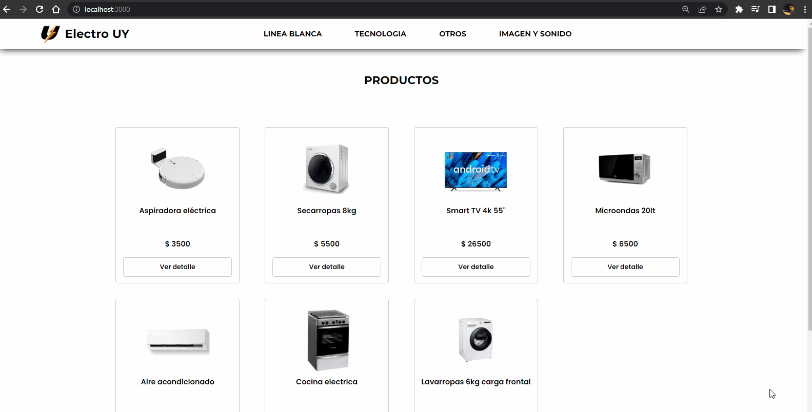

# ELECTRO UY - Ecommerce de electrodomésticos desarrollado con React

ELECTRO UY es un ecommerce de electrodomésticos, elaborado con React.

En esta aplicación, se pueden generar pedidos con sus repectivas órdenes de compra.

Cuenta con una configuración para conectarse a Firebase, mediante la cual accede a las colecciones de productos, las categorías y las órdenes que se van generando.

La estructura de los productos se comprende dentro de la colección "productos".

Cada producto se compone de:
* nombre (string)
* cateoria (string)
* descripcion (string)
* precio (number)
* stock (number)
* imagen (string (es una URL a un directorio de Google Drive))

Para las categorías se define únicamente el campo "nombre" (string) que es idéntico al campo de "categorias" de cada producto.

Las órdenes de compra son generadas programáticamente mediante un funcionalidad de la aplicación.
Commo datos almacena:
* Un objeto Comprador con datos de dirección, nombre, email, telefono y pago
* La colección de productos que conforman la compra
* El total que representa el importe final de la compra 


Para los estilos se utiliza SASS. No se incluye ninguna librería extra.

## Instalación de la app

Para abrir la aplicación en su editor de código y correrla a través de él debes seguir los siguientes pasos: 

### `git clone`

Se debe clonar el repositorio para obtener los archivos necesarios.
Utilizar el comando git clone seguido de la URL del repositorio:

```bash
  git clone https://github.com/ValentinRomero22/ElectroUy_ValentinRomero.git
```

### `npm install`

Una vez clonado el repositorio, desde el direcorio raíz de la aplicación es necesario instalar las depencencias
Ejecutar el comando npm install: 

```bash
  npm install
```

### `npm start`

Finalizada la Instalación, y como último paso para correr la app ejecutar el comando npm start.
Recordar siempre estar ubicado en el directorio raíz:

```bash
  npm start
```

La aplicación se ejecutará en su servidor local:
[http://localhost:3000](http://localhost:3000)

## Funcionalidad, navegación y componentes

La aplicación muestra en todo momento un menú el cual contiene logo y nombre del Ecommerce. También contiene los componentes Navbar y WidgetCart.

El componente Footer acompaña siempre a la aplicación, sin otro fin más que ornamental.

El primero permite navegar entre las categorías de los productos utilizando Link y NavLink de React Router.

El segundo es un widget que renderiza el carrito de compras.

La ruta principal de la aplicación, muestra el listado de todos los productos cargados al momento, proveniente de la colección "productos" de Firebase.
Esta funcionalidad está a cargo de los componentes ItemListContainer, ItemList e Item.

Cada componente Item que se despliega contiene la información básica de un producto. También incluye un componente Link el cuál redirije al detalle del producto.

En caso de que no haya productos para la categoría seleccionada solamente se renderiza el componente ItemListContainer informándosele esto al usuario.

El detalle del producto es responsabilidad de los componentes ItemDetailContanier e ItemDetail.
Dentro del detalle del producto se incluye toda la información mostrada en el componente Item, más el campo de descripción. 

Se incluye también el componente Counter, quién es responsable de ofrecerle al usuario ingresar la cantidad del producto a agregar a su carrito. Los valores están comprendidos entre 1 y el stock actual del producto.

Luego de que el usuario haya agregado el producto el componenter Counter es reemplazado por un Link que ofrece la opción de terminar la compra redirigiéndo al componente Cart.

El WidgetCart, siempre visible, mostrará una actualización de la cantidad de items que el usuario tiene en su carrito.

Además, en caso de que el producto que se está agregando previamente ya estuviera en el carrito, se actualiza su cantidad.

Dentro del componente Cart, el cual es renderizado dentro del componente CartContainer, se muestra por cada item del carrito un componente CartItem, con la información básica de cada uno.

El usuario dispone de las opciones de eliminar uno o varios items, o incluso vaciar el carrito y resetearlo a cero.

En caso de que no hayan items, el Cart es reemplazado por un mensaje de información al usuario.

Si el usuario opta por confirmar la compra, se renderiza el componente Checkout que a su vez muestra el componente Clientform.
Aquí se deben ingresar todos los datos que componen el objeto Comprador que almacena la Orden.
Una vez ingresado datos válidos se procede a generar y almacenar una nueva orden.

Los stocks de los productos son actualizados, y el usuario puede volver al inicio de la aplicación.

Para el caso en el que otras órdenes se hayan generado en el transcurso en el que el usuario elige la cantidad de productos a comprar y confirma su compra, y los stocks se hayan modificado, se comunica un error y no aborta la petición.


## Usabilidad: archivo .gif

Archivo de usabilidad de la aplicación que muestra brevemente el proceso de una compra exitosa:
